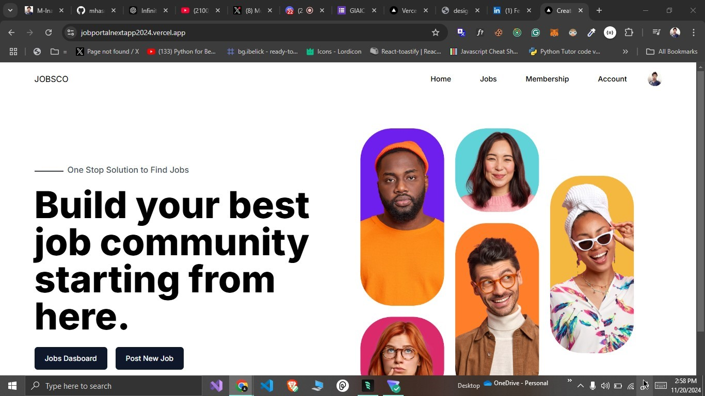

# Next.js Job Portal 2024

## Description
A modern job portal application built with Next.js, offering a seamless experience for job seekers and employers. This platform enables users to post jobs, search for opportunities, and manage their job applications efficiently.

## What Project Look Like:)


## Features
- 🚀 Modern UI with Next.js and Tailwind CSS
- 👥 User authentication and authorization
- 💼 Job posting and management
- 🔍 Advanced job search and filtering
- 📝 Job application tracking
- 💌 Email notifications
- 📱 Responsive design for all devices

## Tech Stack
- Next.js 14
- TypeScript
- Tailwind CSS
- MongoDB
- NextAuth.js
- Mongoose ORB

## Installation

1. Clone the repository
```bash
git clone https://github.com/yourusername/nextjs-job-portal-2024.git
cd nextjs-job-portal-2024
```

2. Install dependencies
```bash
npm install
# or
bun install
```

3. Set up environment variables
```bash
cp .env.example .env.local
```
Fill in your environment variables in `.env.local`

4. Run the development server
```bash
npm run dev
# or
bun dev
```

## Usage
Visit `http://localhost:3000` to see the application running.

### For Job Seekers
- Create an account
- Browse available jobs
- Filter jobs by category, location, or type
- Apply for positions
- Track application status

### For Employers
- Post new job listings
- Manage job postings
- Review applications
- Contact candidates

## Contributing
1. Fork the repository
2. Create your feature branch (`git checkout -b feature/AmazingFeature`)
3. Commit your changes (`git commit -m 'Add some AmazingFeature'`)
4. Push to the branch (`git push origin feature/AmazingFeature`)
5. Open a Pull Request

## License
This project is licensed under the MIT License - see the [LICENSE](LICENSE) file for details.

## Contact
- GitHub: [@hasnainxdev](https://github.com/hasnainxdev)
- Email: codewithhasnainbro@gmail.com

## Acknowledgments
- Next.js team for the amazing framework
- All contributors who have helped this project grow
